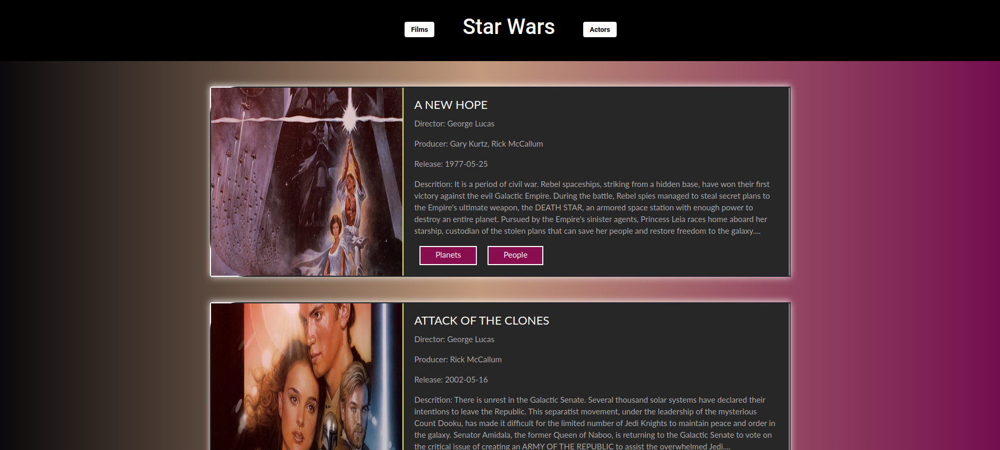
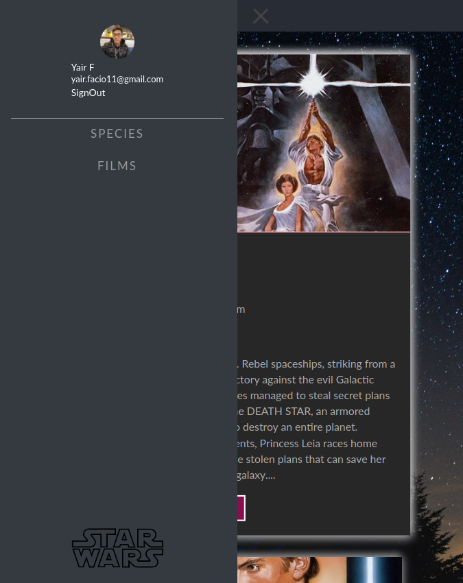

[![Contributors][contributors-shield]][contributors-url]
[![Forks][forks-shield]][forks-url]
[![Stargazers][stars-shield]][stars-url]
[![Issues][issues-shield]][issues-url]
[![LinkedIn][linkedin-shield2]][linkedin-url2]
[![Hireable][hireable]][hireable-url]

<!-- PROJECT LOGO -->
<br />
<p align="center">
 <h2 align="center"> Star Wars Application with react, redux and rails </h2>

  <p align="center">
    Project developed with ruby and rails in the backend and react in the front end using redux to manage the data.
    <br />
    <a href="https://github.com/YairFernando67/React-APIStarWars"><strong>Explore the docs »</strong></a>
    <br />
    <br />
    <a href="https://github.com/YairFernando67/React-APIStarWars">View Demo</a>
    ·
    <a href="https://github.com/YairFernando67/React-APIStarWars/issues">Report Bug</a>
    ·
    <a href="https://github.com/YairFernando67/React-APIStarWars/issues">Request Feature</a>
  </p>

</p>

## Table of Contents
* [About the Project](#about-the-project)
  * [Built With](#built-with)
* [Required Installations](#Required-Installations)
  * [Prerequisites](#Prerequisites)
  * [Installing](#Installing)
  * [Instructions](#Instructions)
  * [Serve Project](#Serve-Project)
* [Instructions](#Instructions)
* [Contact](#contact)
* [Contributing](#Contributing)
* [Show your support](#Show-your-support)

## About The Project

 
 

### Built With
The project was developed using the following technologies:
- [React](https://es.reactjs.org/)
- [Redux](https://github.com/reduxjs/redux)
- [React-Redux](https://github.com/reduxjs/react-redux)
- [Redux-thunk](https://github.com/reduxjs/redux-thunk)
- [React-router-dom](https://github.com/ReactTraining/react-router/tree/master/packages/react-router-dom)
- [JSX](https://reactjs.org/docs/introducing-jsx.html)
- [Axios](https://github.com/axios/axios)
- [BootStrap](https://getbootstrap.com/docs/4.3/getting-started/introduction/)
- [Styled-Components](https://www.styled-components.com/)

## Required Installations

### Prerequisites

This project runs on [Ruby](https://www.ruby-lang.org/en/documentation/installation/), and [Rails](http://installrails.com/)

* Node
* NPM
* Ruby
* Rails

After installation, run `ruby -v` to make sure Ruby installed correctly. Example
```
$ ruby -v
ruby 2.6.4p104 (2019-08-28 revision 67798) [x86_64-linux]
```

Also make sure that Rails is installed, but running `rails -v`. 
Example
```
$ rails -v
Rails 6.0.2.1
```

### Installing

<p>Install the following to get this project running in your machine:</p>

### Instructions

<p>Follow these steps:</p>

Clone the Repository

```Shell
user@pc:~$ git clone https://github.com/YairFernando67/React-APIStarWars
```

Click on the console and to go to the folder that was created

```Shell
user@pc:~$ cd React-APIStarWars
```

Installing dependencies

```Shell
user@pc:~/React-APIStarWars$ npm install
```

```Shell
user@pc:~/React-APIStarWars$ npm start
```

```Shell
user@pc:~/React-APIStarWars$ bundle install --without production
```

```Shell
user@pc:~/React-APIStarWars$ rails db:create
```

```Shell
user@pc:~/React-APIStarWars$ rails db:migrate
```

### Serve Project

Open two tabs on the console on the same folder React-APIStarWars

Start the local server with rails:

```Shell
user@pc:~/React-APIStarWars$ rails s
```

Start the local server with react:

```Shell
user@pc:~/React-APIStarWars$ ./bin/webpack-dev-server
```

Open your browser on [http://localhost:3000](http://localhost:3000)

## Contact

👤 **Yair Fernando Facio**

<a href="https://yairfernando67.github.io/Portfolio/" target="_blank">
    
   

</a>

- Github: [@YairFernando67](https://github.com/YairFernando67)
- Twitter: [@YairFernando18](https://twitter.com/YairFernando18)
- Linkedin: [softwaredeveloperyairfacio](https://www.linkedin.com/in/softwaredeveloperyairfacio/)
- Email: [yair.facio11@gmail.com](https://mail.google.com/mail/?view=cm&fs=1&tf=1&to=yair.facio11@gmail.com)
- Portfolio: [softwaredeveloper](https://yairfernando67.github.io/Portfolio/)

<p align="center">

  Project Link: [https://github.com/YairFernando67/React-APIStarWars](https://github.com/YairFernando67/React-APIStarWars)

</p>

## 🤝 Contributing

Contributions, issues and feature requests are welcome!

Feel free to check the [issues page](https://github.com/YairFernando67/React-APIStarWars/issues).

## Show your support

Give a ⭐️ if you like this project!

<!-- MARKDOWN LINKS & IMAGES -->
[contributors-shield]: https://img.shields.io/github/contributors/YairFernando67/React-APIStarWars.svg?style=flat-square
[contributors-url]: https://github.com/YairFernando67/React-APIStarWars/graphs/contributors
[forks-shield]: https://img.shields.io/github/forks/YairFernando67/React-APIStarWars.svg?style=flat-square
[forks-url]: https://github.com/YairFernando67/React-APIStarWars/network/members
[stars-shield]: https://img.shields.io/github/stars/YairFernando67/React-APIStarWars.svg?style=flat-square
[stars-url]: https://github.com/YairFernando67/React-APIStarWars/stargazers
[issues-shield]: https://img.shields.io/github/issues/YairFernando67/React-APIStarWars.svg?style=flat-square
[issues-url]: https://github.com/YairFernando67/React-APIStarWars/issues
[license-shield]: https://img.shields.io/github/license/YairFernando67/React-APIStarWars.svg?style=flat-square
[license-url]: https://github.com/YairFernando67/React-APIStarWars/blob/master/LICENSE.txt
[linkedin-shield2]: https://img.shields.io/badge/-LinkedIn-black.svg?style=flat-square&logo=linkedin&colorB=555
[linkedin-url2]: https://www.linkedin.com/in/softwaredeveloperyairfacio/
[hireable]: https://cdn.rawgit.com/hiendv/hireable/master/styles/flat/yes.svg
[hireable-url]: https://www.linkedin.com/in/softwaredeveloperyairfacio/

